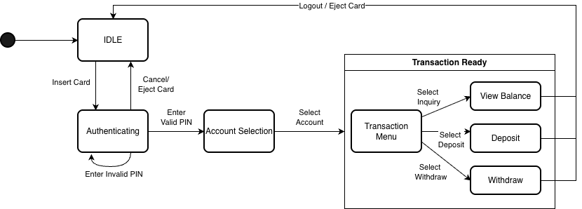

# SDD(Software Design Description): Simple ATM Controller System

## 1. System Architecture
The system is designed with a **Modular Layered Architecture** to ensure that the business logic is decoupled from external bank systems and hardware components.

* **ATM Controller (Core):** Manages the session states and coordinates transaction flows.
* **External Interfaces (Abstraction):** Defines the communication protocol for the `BankService` and `CashBin` to enable future extensibility.
* **Data Models:** Simple structures for representing `Card` and `Account` entities.

---

## 2. Static Structure

### 2.1 Data Models
* **`Card`**: Stores the `card_number`.
* **`Account`**: Stores `account_id` and the current `balance` as an integer ($1 bills only).

### 2.2 Interfaces (Abstract Base Classes)
To support the project's extensibility and testability goals, the following components are abstracted:

| Interface | Method | Description |
| :--- | :--- | :--- |
| **`BankService`** | `verify_pin(card, pin)` | Returns a boolean; the controller never accesses the actual PIN. |
| | `get_accounts(card)` | Retrieves a list of `Account` objects linked to the card. |
| | `update_balance(acc_id, amount)` | Commits the transaction (Deposit/Withdraw) to the bank ledger. |
| **`CashBin`** | `check_stock(amount)` | Verifies if the physical bin has enough $1 bills. |
| | `dispense(amount)` | Executes the physical cash ejection logic. |

---

## 3. Dynamic Behavior (Finite State Machine)

The `ATMController` manages the session through strict state transitions to ensure transaction integrity and user security.

### 3.1 State Diagram
The following diagram illustrates the workflow, emphasizing the automatic logout security feature after physical transactions.



### 3.2 State Transition Table
| Current State | Event | Condition | Next State |
| :--- | :--- | :--- | :--- |
| `IDLE` | `insert_card` | - | `AUTHENTICATING` |
| `AUTHENTICATING` | `enter_pin` | `verify_pin == True` | `ACCOUNT_SELECTION` |
| `ACCOUNT_SELECTION`| `select_account`| Valid Account ID | `TRANSACTION_MENU` |
| **`TRANSACTION_MENU`**| `choose_inquiry` | - | `VIEW_BALANCE` |
| **`VIEW_BALANCE`** | `back / confirm` | User interaction | **`TRANSACTION_MENU`** |
| **`TRANSACTION_MENU`**| `choose_deposit` | - | `DEPOSIT` |
| **`DEPOSIT`** | `deposit_complete`| Transaction Success | **`IDLE` (Auto-Logout)** |
| **`TRANSACTION_MENU`**| `choose_withdraw`| - | `WITHDRAW` |
| **`WITHDRAW`** | `withdraw_complete`| Transaction Success | **`IDLE` (Auto-Logout)** |
| `ANY` | `cancel / eject` | User interaction | `IDLE` |
---

## 4. Controller API (Method Signatures)

These methods provide the interface required for any UI implementation.

```python
class ATMController:
    # Initialization with Dependency Injection
    def __init__(self, bank_service: BankService, cash_bin: CashBin):
        self.state = "IDLE"
        self.current_card = None
        self.current_account = None

    # Flow Control
    def insert_card(self, card_number: str) -> None: ...
    def enter_pin(self, pin: str) -> bool: ...
    def select_account(self, account_id: str) -> None: ...

    # Transactions
    def get_balance(self) -> int: 
        """Returns balance and stays in TRANSACTION_MENU state."""
        pass

    def deposit(self, amount: int) -> bool:
        """Executes deposit and triggers automatic logout (IDLE)."""
        pass

    def withdraw(self, amount: int) -> bool:
        """Executes withdrawal and triggers automatic logout (IDLE)."""
        pass